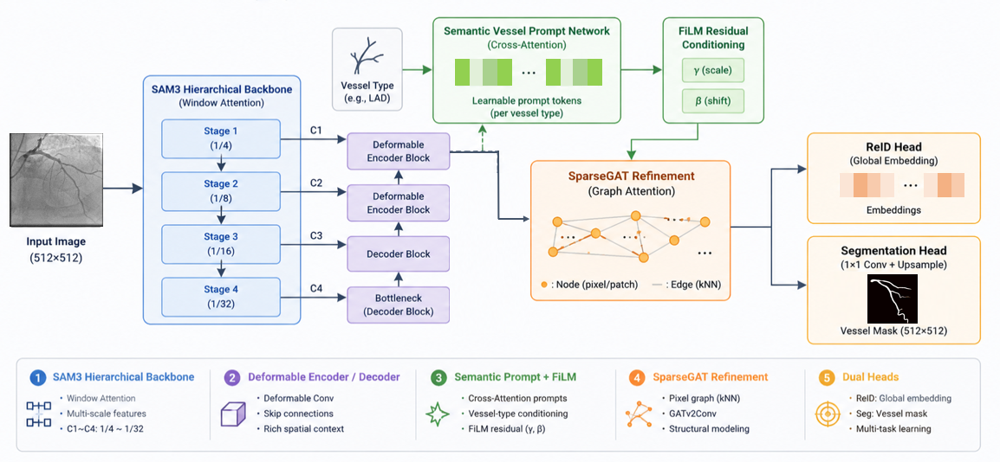
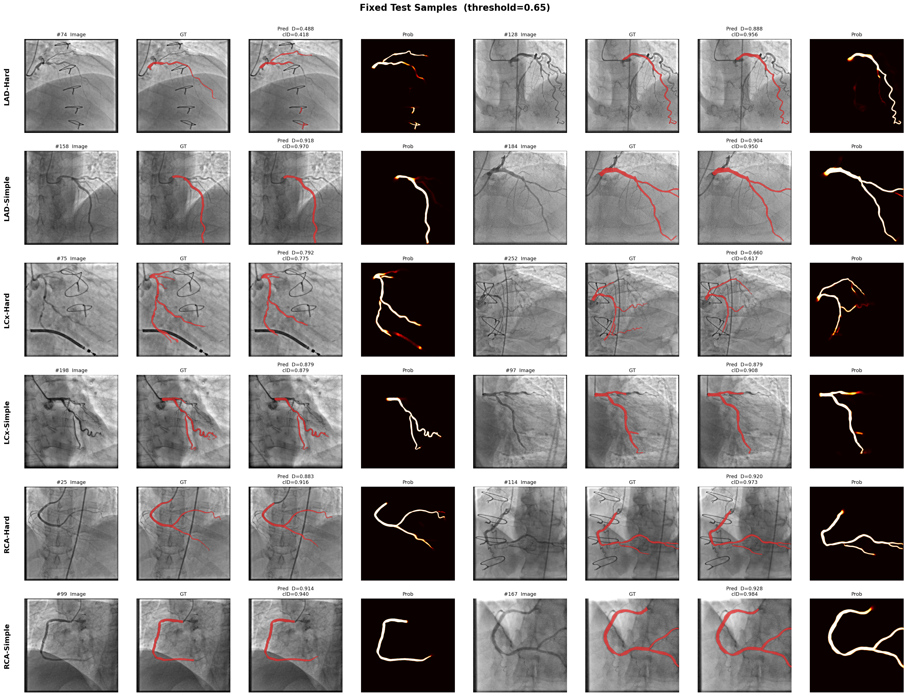

# GATSUN — 冠狀血管語意分割（ARCADE）

在靜態 X 光血管造影上，以 **SAM3 視覺骨幹** 抽取多尺度特徵，接上 **UNet 式解碼器**（最細尺度為 **可變形卷積解碼塊**）、**語意血管提示（Semantic Vessel Prompt）**、**稀疏圖精煉（SparseGAT / 可選密集 GNN）** 與 **Re-ID（InfoNCE）**，針對 **LAD / LCx / RCA** 三類血管做單一聯合模型（JOINT）分割。訓練資料可選 **貝茲曲線偽影增強**（導管／導絲／縫線等，不污染 mask）。

---

## 模型架構（V2）

資料流概覽：

1. **SAM3Encoder**：單通道輸入擴為 3 通道後送入 SAM3 `vision_encoder`，解析 FPN **四層**特徵（預設 `FPN_CH=256`）。
2. **解碼器**：`DecoderBlock` ×2 自深至淺上採樣並與 skip 拼接；**最淺層**使用 `DeformableDecoderBlock`（`torchvision.ops.DeformConv2d` 不可用時自動退回普通卷積），利於細線狀血管之幾何對齊。
3. **血管條件化**：預設 `SemanticVesselPrompt`（可學習 prompt token + 交叉注意力 + **FiLM**）；關閉時改為 `VesselTypeConditioning`（Embedding + 仿射調制）。
4. **粗分割 → 圖精煉**：`pre_seg` 得到初始前景機率，作為 **SparseGAT** 的節點候選門檻（KNN 邊、GATv2）；無 PyG 時改為 **DenseGNNRefinement**（多尺度空洞卷積訊息傳遞）。
5. **輸出**：`seg_head` 產生 2 類 logits（背景／血管）；可選 `ReIDHead` 對前景區域池化得到 **vessel embedding**，供 **InfoNCE** 與視覺化（t-SNE）。

核心實作：`unet_v2.py`（`UNetV2`、`SegLossV2`）、`train_v2.py`、`evaluate_v2.py`、`data_loader_v2.py`。SAM3 上游在 `sam3git/`。

---

## 損失函數 `SegLossV2`

已改為與血管拓撲、邊界相一致的組合：

| 元件 | 說明 |
|------|------|
| **加權 BCE** | 在 `build_weight_map` 上：邊界距離加權 + 骨架帶加權，強調細長結構與輪廓 |
| **加權 Dice** | 與同一空間權重結合 |
| **clDice** | `SoftSkeletonize` 近似骨架，`λ_cldice` 預設 **0.5**（`train_v2.py --lambda_cldice`） |
| **InfoNCE** | 可選，`λ_reid` 預設 **0.1**（`--lambda_reid`；`--no_reid` 關閉） |

訓練迴圈會記錄 `bce_loss`、`dice_loss`、`cldice_loss`、`dice_coeff`（及 `reid_loss`）至 `train_log.csv`。

---

## 專案重點速覽

| 項目 | 說明 |
|------|------|
| 資料 | ARCADE 風格目錄；`vessel_id`：**0=LAD，1=LCx，2=RCA** |
| 骨幹 | `sam3_weights/sam3.pt`（路徑由 `--checkpoint` 指定）；可 `--unfreeze` 微調 |
| 圖模組 | 預設 **SparseGAT**（層數／頭數／k／max_nodes／threshold 可調）；`--use_dense_gnn` 為密集後備 |
| 增強 | `data_loader_v2.py`：幾何（如 elastic）、mask 感知 **cutout**、貝茲偽影等；`--artifact_prob` 控制偽影機率 |

---

## 環境需求

- **Python** + **PyTorch**（建議與官方 wheel 對應的 CUDA 版本）  
- **PyTorch Geometric**（建議安裝以啟用 SparseGAT；否則自動使用密集 GNN）  
- **SciPy**、**OpenCV**、**scikit-image**、**matplotlib**  
- 可 `import sam3`（安裝 `sam3git` 或將路徑加入 `PYTHONPATH`）

本 repo 未附固定版號的 `requirements.txt`，請依機器 CUDA 自行對齊 PyTorch / PyG。

---

## 資料與目錄約定

- `--data`：資料根目錄（例如 `C:/.../ARCADE`）。  
- 載入、快取、`merge_split`、增強等見 `data_loader_v2.py`。  
- SAM3 權重：訓練時以 `--checkpoint` 指向 `sam3.pt`。

---

## 一鍵訓練 + 評估

編輯 `run_all_v2.sh` 頂部變數後執行：

```bash
sh run_all_v2.sh
```

Windows 可透過 Git 自帶的 `sh`：

```powershell
& "C:\Program Files\Git\bin\sh.exe" run_all_v2.sh
```

流程：環境檢查 → `train_v2.py`（權重與 `train_log.csv` 寫入 `checkpoints_v2/`）→ `evaluate_v2.py`（圖表與指標寫入 `results_v2/`）。

腳本內 **`PER_VESSEL=true`** 時改為三條血管各訓一個子目錄模型（如 `checkpoints_v2/LAD`）。

---

## 手動指令範例

訓練（其餘旗標請對齊 `train_v2.py --help`）：

```bash
python train_v2.py --data <ARCADE_ROOT> --vessels LAD,LCx,RCA \
  --img_size 512 --epochs 100 --batch 6 --accum_steps 1 --lr 1e-4 \
  --save_dir ./checkpoints_v2 --checkpoint <path/to/sam3.pt> \
  --merge_split --val_ratio 0.1 --split_seed 67 --amp --unfreeze \
  --lambda_cldice 0.5 --cldice_iter 10 --lambda_reid 0.1
```

評估：

```bash
python evaluate_v2.py --data <ARCADE_ROOT> \
  --ckpt ./checkpoints_v2/best_model.pth \
  --log_csv ./checkpoints_v2/train_log.csv \
  --vessels LAD,LCx,RCA --img_size 512 --batch 6 \
  --out_dir ./results_v2 --n_vis 20 --top_k 4 \
  --cldice_iter 10 --gnn_iters 3 --pp_min_size 50
```

評估階段預設：**四向翻轉 TTA**、後處理 **high=0.5**、**low=None**（無雙閾 hysteresis）、`min_size` 小物件過濾；逐張寫入 **Dice / clDice / IoU / HD95**（像素距離）至 `test_metrics.csv`。HD95 與 IoU 實作見 `eval_metrics_extras.py`。

---

## 訓練設定參考（對齊 `run_all_v2.sh` 預設思路）

以下為腳本中常見預設方向，實際數值請以你本機 `run_all_v2.sh` 與 `train_v2.py` 為準：

| 設定 | 說明 |
|------|------|
| 模式 | **JOINT**：單模型 `LAD,LCx,RCA` |
| 影像 | 512×512 |
| 切分 | `--merge_split`、`--val_ratio`、`--split_seed` |
| 優化 | AdamW、warmup + cosine；backbone 可用較小 `backbone_lr_scale` |
| SparseGAT | 例如 2 層、4 heads、k=16、max_nodes=4096、node_threshold=0.3 |
| 偽影 | `artifact_prob` 可設 0（純乾淨影像）至約 0.35（較強增廣） |

`train_v2.py` 會將結構相關設定存入 `checkpoints_v2/model_config.pth`，供 `evaluate_v2.py` 還原與訓練時相同的 GAT／提示／ReID 開關。

---

## 測試集最佳結果（300 張）

下列為目前管線在測試集上回報之 **整體 mean ± std**（每張圖先算再平均）與 **分血管平均**；推理與 `evaluate_v2.py` 一致（含 TTA 與固定閾值後處理）。**RCA** 在各指標上優於 LAD 與 LCx，與解剖上右冠較常呈單幹、對比相對集中等現象一致，但仍需依臨床資料分布解讀。

### 整體

| 指標 | mean ± std |
|------|------------|
| **Dice** | **0.8154 ± 0.0951** |
| **clDice** | **0.8196 ± 0.1168** |
| **IoU** | **0.6980 ± 0.1217** |
| **HD95**（px） | **58.2507 ± 48.7426** |

### 各血管（樣本數 N 與平均）

| 血管 | N | Dice | clDice | IoU | HD95（px） |
|------|---:|------|--------|-----|------------|
| **LAD** | 87 | 0.7894 | 0.7976 | 0.6677 | 64.91 |
| **LCx** | 113 | 0.7932 | 0.7969 | 0.6642 | 63.58 |
| **RCA** | 100 | 0.8631 | 0.8643 | 0.7626 | 46.43 |


---

## 視覺化與輸出檔案

執行 `evaluate_v2.py` 後，`results_v2/` 典型內容：

| 檔案 | 說明 |
|------|------|
| `training_curves.png` | 由 `train_log.csv` 繪製 |
| `summary_grid.png` | 依 Dice 挑選 worst / median / best 等網格 |
| `fixed_samples.png` | 預設難／易案例對照（見 `FIXED_VIS_SAMPLES`） |
| `reid_tsne.png` | 測試集 vessel embedding 之 t-SNE（若訓練啟用 ReID） |
| `test_metrics.csv` | 每張：**dice, cldice, iou, hd95, vessel_id** |
| `inference_profile.txt` | `eval_metrics_extras` 估算之 GFLOPs 與延遲 |

比對圖目錄：`results_v2/compare_vis/`（若啟用視覺化匯出）。

---

## `test_metrics.csv` 範例列

**較佳範例（Dice 高）**

| filename | dice | cldice | iou | vessel_id |
|----------|------|--------|-----|-----------|
| 101 | 0.9525 | 0.9738 | 0.9094 | 2 (RCA) |
| 53 | 0.9402 | 0.9618 | 0.8871 | 2 (RCA) |
| 139 | 0.9399 | 0.9908 | 0.8867 | 2 (RCA) |
| 64 | 0.9376 | 0.9850 | 0.8826 | 0 (LAD) |

**較難範例（Dice 低，供錯誤分析）**

| filename | dice | cldice | vessel_id |
|----------|------|--------|-----------|
| 146 | 0.2806 | 0.1816 | 0 (LAD) |
| 152 | 0.4388 | 0.4356 | 0 (LAD) |
| 74 | 0.4882 | 0.4176 | 0 (LAD) |

完整 300 筆見 `results_v2/test_metrics.csv`。

---

## 常見調整

- **關閉 Re-ID 或語意提示**：`--no_reid`、`--no_semantic_prompt`。  
- **密集 GNN**：`--use_dense_gnn`。  
- **增強強度**：調整 `--artifact_prob`；幾何與 cutout 在 `data_loader_v2.py` 內可再細調。  
- **後處理**：`evaluate_v2.py` 之 `pp_min_size`、`--pp_keep_top_k` 等（見 `--help`）。

---

## 授權與引用

使用 `sam3git/` 時請遵循原 SAM3 專案授權與論文引用；本 README 僅描述本目錄內之訓練與評估流程。
